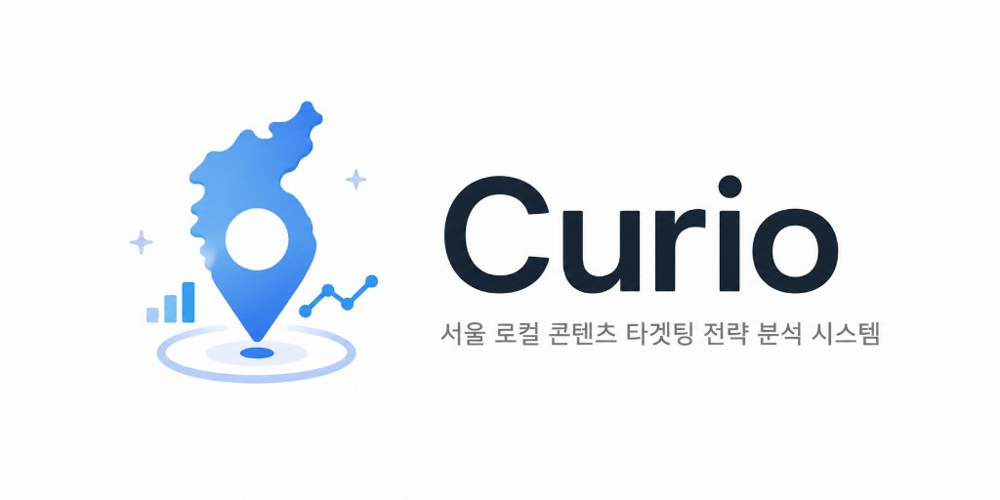
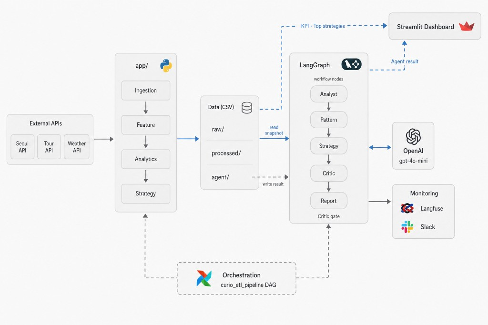
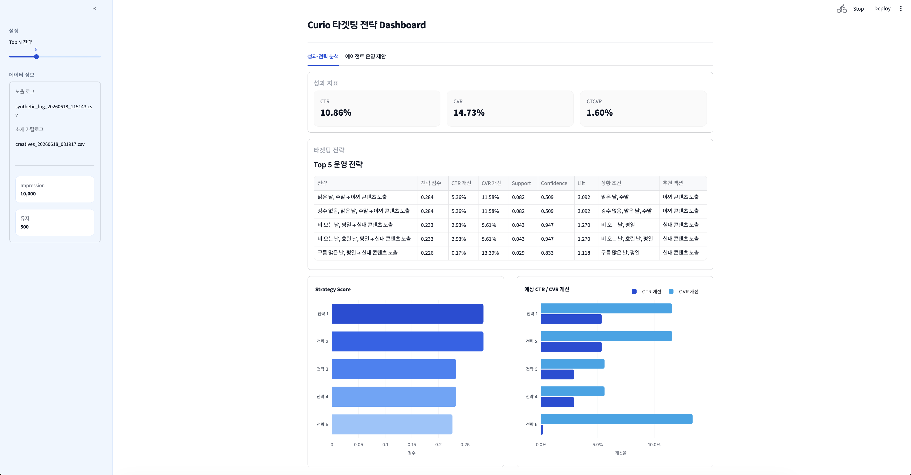
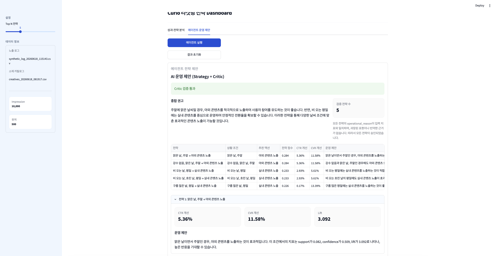
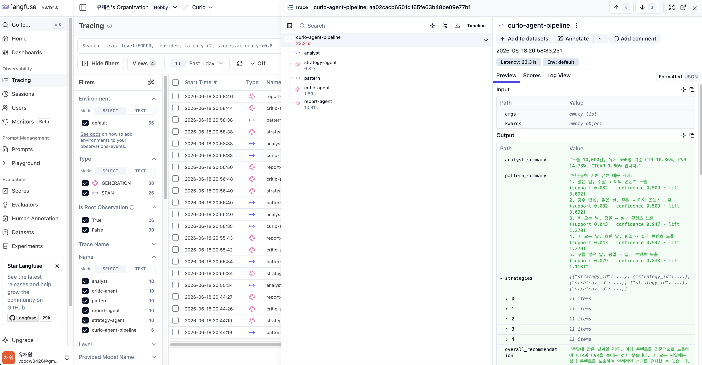
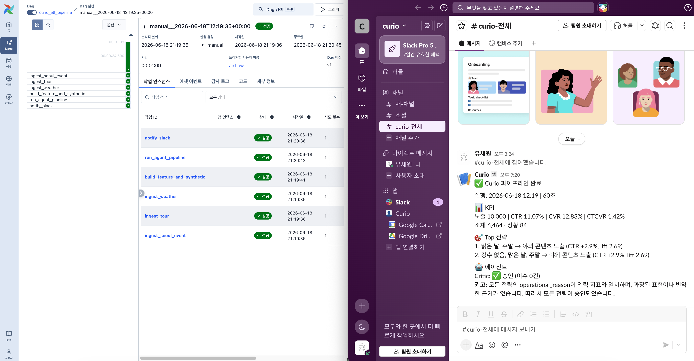
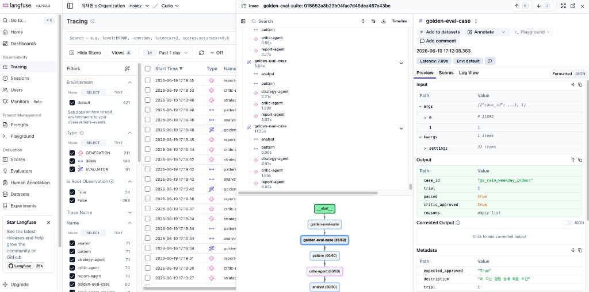

<p align="center">
  
</p>

<p align="center">
  
  
  
  
  
  
</p>

<br />

Curio는 문화행사, 관광, 날씨 데이터를 분석하여 상황별 유효 대응 전략을 생성하고, Multi-Agent Workflow를 통해 이를 자연어 인사이트로 해석하는 AI 기반 콘텐츠 전략 분석 시스템입니다.

단순히 데이터를 수집하는 것에 그치지 않고, 데이터 파이프라인 구축부터 패턴 분석, 전략 생성, Multi-Agent 기반 해석, 대시보드 및 모니터링까지 하나의 흐름으로 연결하여 데이터로부터 실행 가능한 인사이트를 도출하는 것을 목표로 합니다.

### Key Features
- 문화행사 · 관광 · 날씨 데이터 수집 및 통합
- KMeans 군집화 및 Apriori 기반 패턴 분석
- Strategy Score 기반 유효 대응 전략 생성
- LangGraph Multi-Agent Workflow를 통한 전략 해석 및 보고서 생성
- Streamlit Dashboard 및 Langfuse·Slack 기반 모니터링
- 골든셋 20케이스 pass@k 기반 Agent 품질 평가

<br /><br />

## Architecture



<div align="center">

| 단계 | 구성 | 한 줄 설명 |
|:-:|:-:|:-:|
| ① | **External APIs** → **app/** | 문화행사 · 관광 · 날씨 API를 수집하고 feature · synthetic log까지 생성 |
| ② | **Data (CSV)** | 분석 입력과 Agent 결과 JSON 저장 |
| ③ | **LangGraph** | Top 5 전략에 운영 설명을 붙이고 **Critic**으로 검증 |
| ④ | **Streamlit** | CSV에서 KPI·Top N, LangGraph에서 Agent 결과를 표시 |
| ⑤ | **Airflow · Langfuse · Slack** | DAG로 ETL→Agent 실행, trace 기록, 성공·실패·Critic 거절 알림 |

</div>

<br /><br />

## Demo

### Dashboard

| KPI · Top 전략 | Agent 패널 |
|----------------|------------|
|  |  |

### Monitoring

| Langfuse trace | Airflow + Slack |
|----------------|------------------------|
|  |  |

### Agent Evaluation

골든셋 20케이스로 Multi-Agent Workflow 품질을 평가했습니다.

| pass@k 결과 | Langfuse `golden-eval` |
|-------------|------------------------|
| <table align="center"><tr><th>pass@1</th><th>pass@3</th><th>pass^3</th></tr><tr><td align="center"><strong>0.80</strong></td><td align="center"><strong>0.95</strong></td><td align="center"><strong>0.70</strong></td></tr></table> |  |

<br /><br />

## Quick Start

<br />

### Prerequisites

<p align="center">
  
  <a href="https://docs.astral.sh/uv/"></a>
  
  
</p>

```bash
uv sync
cp .env.example .env
# 필수 API key 입력
# Optional
# OPENAI_API_KEY
# LANGFUSE_*
# SLACK_WEBHOOK_URL
```

### Pipeline 실행

```bash
# Ingestion
uv run python -m app.ingestion.seoul_event.run
uv run python -m app.ingestion.tour.run
uv run python -m app.ingestion.weather.run

# Feature + synthetic log 생성
uv run python -m app.preprocessing.feature.run

# 기존 processed CSV가 있을 때
uv run python -m app.preprocessing.feature.run --skip-feature
```

### Dashboard

```bash
uv run streamlit run app/dashboard/main.py
```

### Agent

```bash
uv run python -m app.agents.run
```

### Airflow (선택)

```bash
docker compose up -d --build
```

`http://localhost:8080`에서 **`curio_etl_pipeline`** DAG trigger

### Tests

```bash
uv run ruff check
uv run pytest
```
